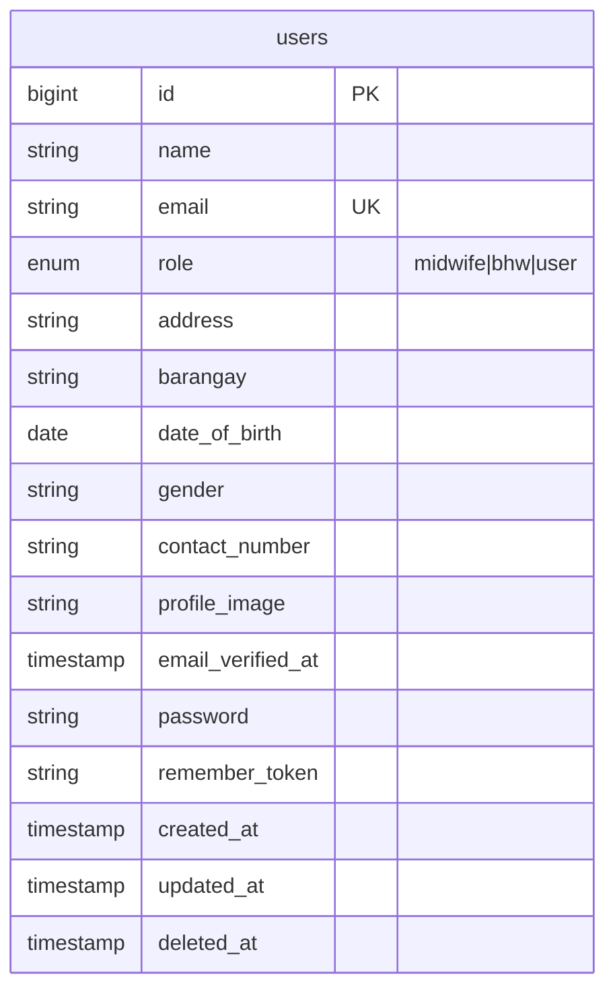
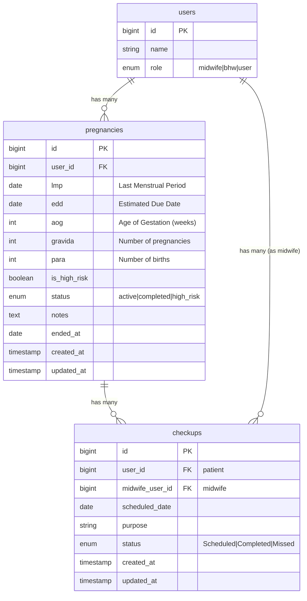
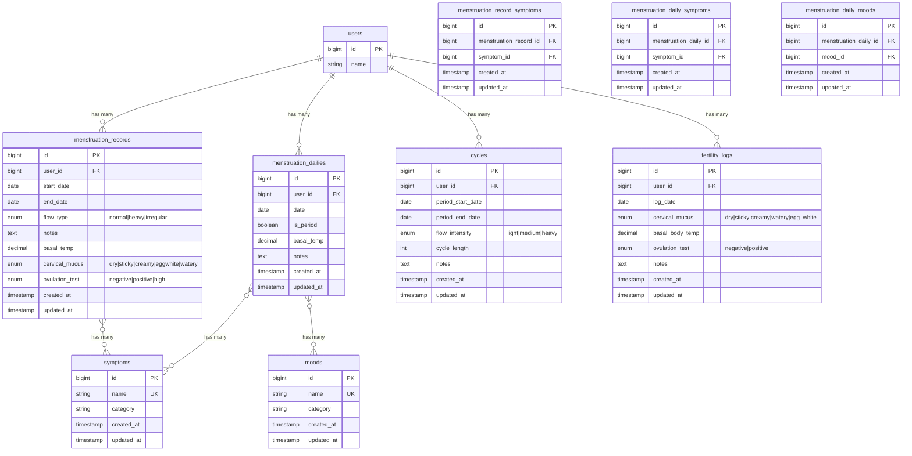
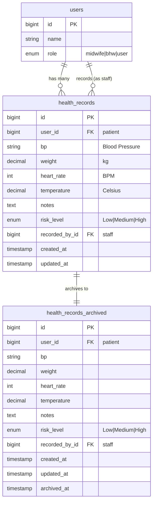
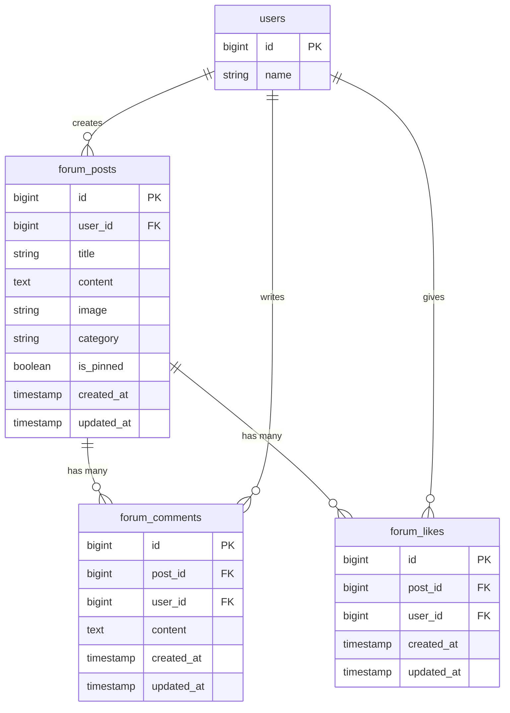
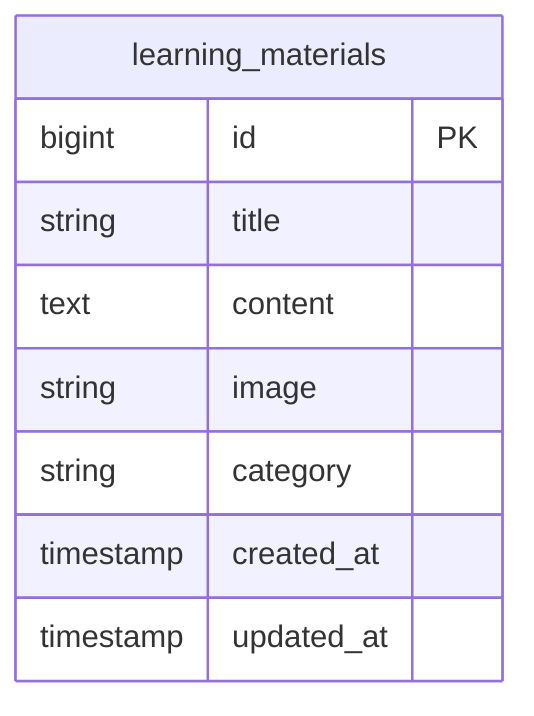
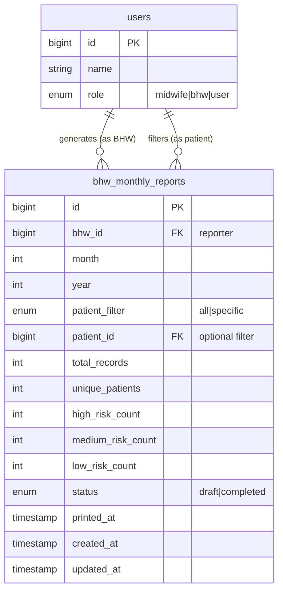

# ReproCare Entity Relationship Diagrams

Generated on: April 16, 2026
Format: Mermaid (can be rendered in GitHub, VS Code, or online viewers)

## Table of Contents

1. [Master Overview](#master-overview)
2. [User Management Module](#user-management-module)
3. [Pregnancy Tracking Module](#pregnancy-tracking-module)
4. [Menstrual Health Module](#menstrual-health-module)
5. [Health Records Module](#health-records-module)
6. [Forum Module](#forum-module)
7. [Learning Materials Module](#learning-materials-module)
8. [BHW Reports Module](#bhw-reports-module)

---

## Master Overview

```mermaid
erDiagram
    users ||--o{ pregnancies : "has many"
    users ||--o{ menstruation_records : "has many"
    users ||--o{ menstruation_dailies : "has many"
    users ||--o{ cycles : "has many"
    users ||--o{ fertility_logs : "has many"
    users ||--o{ health_records : "has many"
    users ||--o{ checkups : "has many (as patient)"
    users ||--o{ checkups : "has many (as midwife)"
    users ||--o{ forum_posts : "has many"
    users ||--o{ bhw_monthly_reports : "has many (as BHW)"
    users ||--o{ bhw_monthly_reports : "has many (as patient)"
    
    pregnancies ||--o{ checkups : "has many"
    menstruation_records }o--o{ symptoms : "has many"
    menstruation_dailies }o--o{ symptoms : "has many"
    menstruation_dailies }o--o{ moods : "has many"
    forum_posts ||--o{ forum_comments : "has many"
    forum_posts ||--o{ forum_likes : "has many"
    
    users {
        bigint id PK
        string name
        string email UK
        enum role "midwife|bhw|user"
        string address
        string barangay
        date date_of_birth
        string gender
        string contact_number
        string profile_image
        timestamp email_verified_at
        string password
        string remember_token
        timestamp created_at
        timestamp updated_at
        timestamp deleted_at
    }
    
    pregnancies {
        bigint id PK
        bigint user_id FK
        date lmp
        date edd
        int aog
        int gravida
        int para
        boolean is_high_risk
        enum status "active|completed|high_risk"
        text notes
        date ended_at
        timestamp created_at
        timestamp updated_at
    }
    
    menstruation_records {
        bigint id PK
        bigint user_id FK
        date start_date
        date end_date
        enum flow_type "normal|heavy|irregular"
        text notes
        decimal basal_temp
        enum cervical_mucus "dry|sticky|creamy|eggwhite|watery"
        enum ovulation_test "negative|positive|high"
        timestamp created_at
        timestamp updated_at
    }
    
    menstruation_dailies {
        bigint id PK
        bigint user_id FK
        date date
        boolean is_period
        decimal basal_temp
        text notes
        timestamp created_at
        timestamp updated_at
    }
    
    cycles {
        bigint id PK
        bigint user_id FK
        date period_start_date
        date period_end_date
        enum flow_intensity "light|medium|heavy"
        int cycle_length
        text notes
        timestamp created_at
        timestamp updated_at
    }
    
    fertility_logs {
        bigint id PK
        bigint user_id FK
        date log_date
        enum cervical_mucus "dry|sticky|creamy|watery|egg_white"
        decimal basal_body_temp
        enum ovulation_test "negative|positive"
        text notes
        timestamp created_at
        timestamp updated_at
    }
    
    health_records {
        bigint id PK
        bigint user_id FK
        string bp
        decimal weight
        int heart_rate
        decimal temperature
        text notes
        enum risk_level "Low|Medium|High"
        bigint recorded_by_id FK
        timestamp created_at
        timestamp updated_at
    }
    
    checkups {
        bigint id PK
        bigint user_id FK "patient"
        bigint midwife_user_id FK "midwife"
        date scheduled_date
        string purpose
        enum status "Scheduled|Completed|Missed"
        timestamp created_at
        timestamp updated_at
    }
    
    symptoms {
        bigint id PK
        string name UK
        string category
        timestamp created_at
        timestamp updated_at
    }
    
    moods {
        bigint id PK
        string name UK
        string category
        timestamp created_at
        timestamp updated_at
    }
    
    forum_posts {
        bigint id PK
        bigint user_id FK
        string title
        text content
        string image
        string category
        boolean is_pinned
        timestamp created_at
        timestamp updated_at
    }
    
    forum_comments {
        bigint id PK
        bigint post_id FK
        bigint user_id FK
        text content
        timestamp created_at
        timestamp updated_at
    }
    
    forum_likes {
        bigint id PK
        bigint post_id FK
        bigint user_id FK
        timestamp created_at
        timestamp updated_at
    }
    
    bhw_monthly_reports {
        bigint id PK
        bigint bhw_id FK
        int month
        int year
        enum patient_filter "all|specific"
        bigint patient_id FK
        int total_records
        int unique_patients
        int high_risk_count
        int medium_risk_count
        int low_risk_count
        enum status "draft|completed"
        timestamp printed_at
        timestamp created_at
        timestamp updated_at
    }
    
    learning_materials {
        bigint id PK
        string title
        text content
        string image
        string category
        timestamp created_at
        timestamp updated_at
    }
```

---

## User Management Module

**Constraints:**
- Primary Key: id
- Unique Key: email
- Index: role, barangay
- Soft Deletes: deleted_at

**Description:**
- Central table for all user accounts (patients, midwives, BHWs)
- Role-based access control (RBAC)
- Soft deletes enabled
- Stores profile information and authentication data

---

## Pregnancy Tracking Module

**pregnancies Constraints:**
- Foreign Keys: user_id -> users.id (CASCADE)
- Indexes: user_id, is_high_risk, user_id+is_high_risk, ended_at

**checkups Constraints:**
- Foreign Keys: user_id -> users.id (CASCADE), midwife_user_id -> users.id
- Indexes: user_id, midwife_user_id, scheduled_date, status, user_id+scheduled_date

**Description:**
- Tracks pregnancy information for patients
- Calculates gestational age, trimester, milestones
- Manages scheduled checkups with midwives
- High-risk pregnancy tracking
- Links to patient records

---

## Menstrual Health Module

**menstruation_records Constraints:**
- Foreign Keys: user_id -> users.id (CASCADE)
- Many-to-Many: symptoms via menstruation_record_symptoms

**menstruation_dailies Constraints:**
- Foreign Keys: user_id -> users.id (CASCADE)
- Many-to-Many: symptoms via menstruation_daily_symptoms, moods via menstruation_daily_moods
- Unique: user_id + date

**cycles Constraints:**
- Foreign Keys: user_id -> users.id (CASCADE)
- Indexes: user_id, period_start_date, user_id+period_start_date

**fertility_logs Constraints:**
- Foreign Keys: user_id -> users.id (CASCADE)
- Unique: user_id + log_date
- Indexes: user_id, log_date, user_id+log_date

**Description:**
- Comprehensive menstrual cycle tracking
- Daily symptom and mood logging (normalized with pivot tables)
- Cycle length calculation and prediction
- Fertility tracking with basal body temperature
- Lookup tables for symptoms and moods
- Supports cycle prediction algorithms

---

## Health Records Module

**health_records Constraints:**
- Foreign Keys: user_id -> users.id (CASCADE), recorded_by_id -> users.id
- Indexes: user_id+created_at, risk_level, recorded_by_id

**health_records_archived:**
- Archive table for old health records
- Same structure as health_records + archived_at

**Description:**
- Tracks vital signs and health metrics
- Risk level assessment (Low/Medium/High)
- Records created by midwives or BHWs
- Archive table for historical data
- Supports health reporting and analysis

---

## Forum Module

**forum_posts Constraints:**
- Foreign Keys: user_id -> users.id (CASCADE)
- Has many: comments, likes

**forum_comments Constraints:**
- Foreign Keys: post_id -> forum_posts.id (CASCADE), user_id -> users.id (CASCADE)

**forum_likes Constraints:**
- Foreign Keys: post_id -> forum_posts.id (CASCADE), user_id -> users.id (CASCADE)

**Description:**
- Community forum for patients
- Posts with categories and images
- Comment system for discussions
- Like system for engagement
- Pin important posts

---

## Learning Materials Module

**learning_materials Constraints:**
- Standalone table
- No foreign keys
- Managed by midwives/admins
- Categories: nutrition, prenatal, postpartum, etc.

**Description:**
- Educational content for patients
- Categorized learning materials
- Images and rich text content
- Managed by midwives

---

## BHW Reports Module

**bhw_monthly_reports Constraints:**
- Foreign Keys: bhw_id -> users.id (RESTRICT), patient_id -> users.id (CASCADE)
- Monthly health records aggregation
- Risk distribution statistics
- Print tracking with printed_at

**Description:**
- Monthly health reports generated by BHWs
- Filter by all patients or specific patient
- Statistics dashboard (records, patients, risk levels)
- Status tracking (draft/completed)
- Print tracking for audit purposes

---

## Legend

**Symbols:**
- `||--||` One-to-One (1:1)
- `||--o{` One-to-Many (1:N)
- `}o--o{` Many-to-Many (M:N)

**Key Notations:**
- PK = Primary Key
- FK = Foreign Key
- UK = Unique Key
- UK = Unique Key

**Relationship Actions:**
- CASCADE = Delete related records
- RESTRICT = Prevent deletion if related records exist

---

## How to View These ERDs

**Option 1: GitHub**
- Upload this file to GitHub
- GitHub automatically renders Mermaid diagrams

**Option 2: VS Code**
- Install "Mermaid Preview" extension
- Open this file and click "Preview"

**Option 3: Online Viewers**
- Visit https://mermaid.live/
- Copy/paste the Mermaid code blocks

**Option 4: Export to PNG/SVG**
- Use Mermaid CLI: `npm install -g @mermaid-js/mermaid-cli`
- Run: `mmdc -i ERD.md -o output.png`

---

## Notes

- All timestamp fields use Laravel's default timestamp format
- Soft deletes enabled on users table (deleted_at)
- Pivot tables use composite unique constraints
- Performance indexes added for common query patterns
- Database is fully normalized to 3NF
