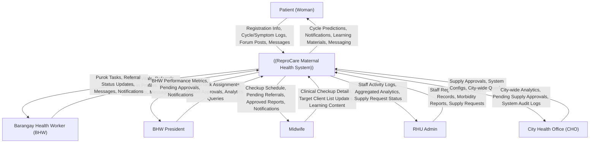
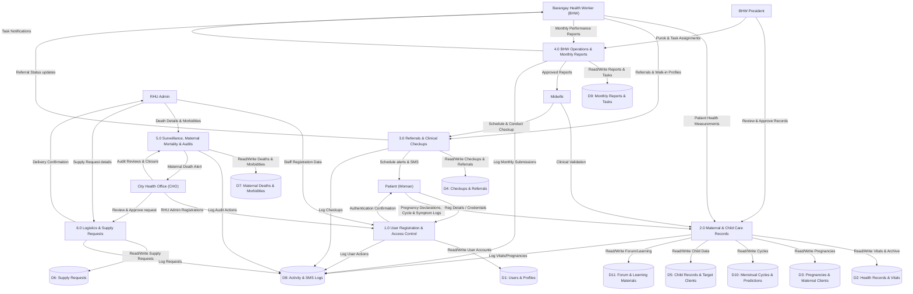
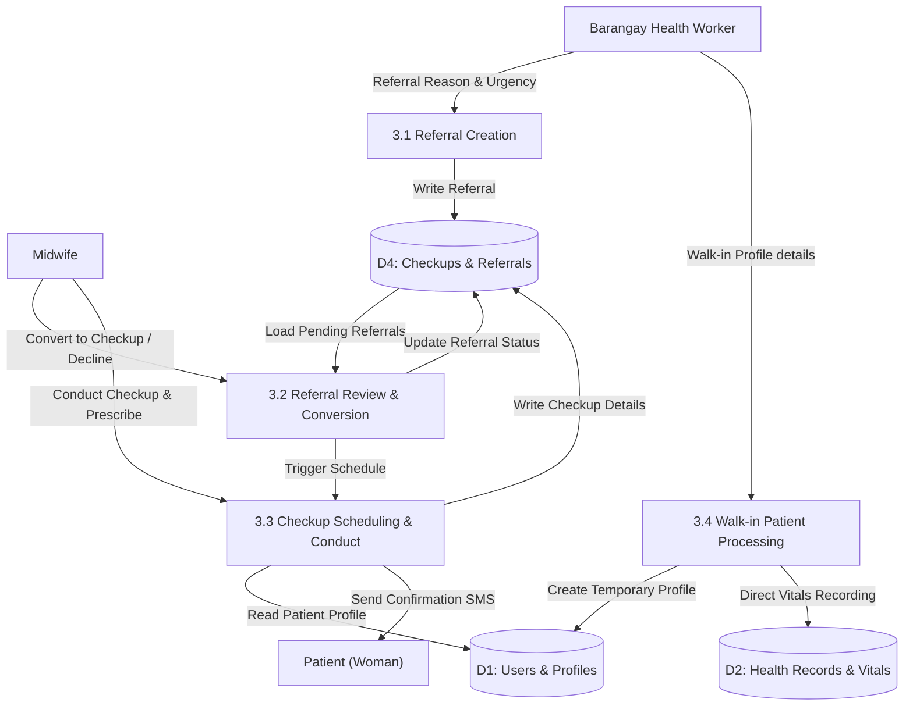

# ReproCare Maternal & Child Health System
## Proposed Data Flow Diagrams (DFD) and Entity Relationship Diagrams (ERD) Technical Documentation

This document contains the capstone-level technical specifications, Data Flow Diagrams (DFDs), and Entity Relationship Diagrams (ERDs) for the **ReproCare Maternal & Child Health Management System**.

---

## 1. System Scope & Architecture

ReproCare is a web-based maternal and child health management platform designed to replace manual, paper-based processes at the barangay and city health levels. The system is split into two primary portals:

1. **Clinical Portal (Barangay Level)**:
   - **Patients (Women)**: Track menstrual cycles, view personal checkup histories, access pregnancy week-by-week guides, submit self-reported health records, and participate in discussion forums.
   - **Barangay Health Workers (BHWs)**: Conduct home visits, record patient vitals, manage walk-in patients, refer high-risk cases, and draft monthly performance reports.
   - **Midwives**: Conduct clinical prenatal and postpartum checkups, manage target client lists (maternal and child care), and log vaccinations and supplements.

2. **Administrative & Supervision Portal (RHU and City Levels)**:
   - **BHW Presidents**: Supervise BHWs, assign puroks, track task completion, and approve BHW monthly reports.
   - **RHU Admins**: Oversee all midwives and BHWs within their Rural Health Unit, record maternal deaths and morbidities, conduct death audits, submit supply requests, and generate official DOH reports (FHSIS).
   - **City Health Office (CHO)**: Monitor city-wide trends, audit maternal deaths, approve supply requests, and manage RHU administrator accounts.

---

## 2. Data Flow Diagrams (DFD)

Data Flow Diagrams illustrate the flow of data through the ReproCare system, showing how external entities interact with the system boundary, how data is processed, and how it is read from or written to database stores.

### DFD Notation Key
- **External Entities (Sinks/Sources)**: Rectangles with bold labels. Represents entities outside the system boundary.
- **Processes**: Rounded boxes or circles with IDs (e.g., `1.0`, `2.1`). Represents data transformation functions.
- **Data Stores**: Cylindrical boxes (`[("Store Name")]`). Represents database tables.
- **Data Flows**: Labeled arrows representing the movement of data.

---

### DFD Level 0: Context Diagram

The Context Diagram shows the entire ReproCare system as a single process boundary and illustrates the high-level inputs and outputs exchanged with the six external entities.



---

### DFD Level 1: Core System Processes

Level 1 decomposes the system into six core functional areas, highlighting the primary database stores (D1–D11) and the data paths between processes.



---

### DFD Level 2: Exploded Process Breakdown

To provide the detailed "exploded" specification required for capstone evaluation, the core processes have been further decomposed into Level 2 processes.

#### Process 2.0: Maternal & Child Care Records (Exploded)
This process manages patient data collection, validation, and multi-level approval.

```mermaid
graph TD
    Patient["Patient (Woman)"]
    BHW["Barangay Health Worker"]
    BHW_Pres["BHW President"]
    Midwife["Midwife"]
    
    P2_1["2.1 Patient Registration Approval"]
    P2_2["2.2 Health Record Vitals Entry & Workflow"]
    P2_3["2.3 Pregnancy Risk Assessment"]
    P2_4["2.4 Child Health Record Tracking"]
    
    D1[("D1: Users & Profiles")]
    D2[("D2: Health Records & Vitals")]
    D3[("D3: Pregnancies & Maternal Clients")]
    D5[("D5: Child Records & Target Clients")]
    
    Patient -->|Reg Details| P2_1
    BHW -->|Review & Verify| P2_1
    BHW_Pres -->|Approve/Reject| P2_1
    Midwife -->|Final Approval| P2_1
    P2_1 -->|Update Status| D1
    
    BHW -->|Record BP, Weight, Temp| P2_2
    P2_2 -->|Write Vitals (Draft)| D2
    BHW_Pres -->|Review & Approve| P2_2
    P2_2 -->|Pass Vitals to Midwife| D2
    Midwife -->|Clinical Validation & Accept| P2_2
    P2_2 -->|Write Approved Vitals| D2
    
    P2_2 -->|Trigger Risk Check| P2_3
    P2_3 -->|Read Pregnancy Data| D3
    P2_3 -->|Auto-assess High-Risk Flags| D3
    
    Midwife -->|Enter Birth Details & ENC| P2_4
    P2_4 -->|Read/Write Child Profiles| D5
```

---

#### Process 3.0: Referrals & Clinical Checkups (Exploded)
This process details the transition from BHW home visit referrals to Midwife clinical checkups.



---

#### Process 5.0: Surveillance, Maternal Mortality & Audits (Exploded)
Decomposes maternal death recording and the subsequent case audit.

```mermaid
graph TD
    RHU_Admin["RHU Admin"]
    CHO["City Health Office (CHO)"]
    
    P5_1["5.1 Maternal Death Recording"]
    P5_2["5.2 Morbidity Logging & Linkage"]
    P5_3["5.3 Death Case Audit & Closure"]
    
    D7[("D7: Maternal Deaths & Morbidities")]
    D1[("D1: Users & Profiles")]
    D8[("D8: Activity & SMS Logs")]
    
    RHU_Admin -->|Death Date, Cause, Location| P5_1
    P5_1 -->|Read Patient/Walk-in| D1
    P5_1 -->|Write Death Record| D7
    P5_1 -->|Trigger Death Alert SMS/Notify| CHO
    
    RHU_Admin -->|Log Near-Miss Complications| P5_2
    P5_2 -->|Write Morbidity Record| D7
    P5_2 -->|Link Morbidity to Death (If Fatal)| D7
    
    CHO -->|Review Death & Enter Audit Notes| P5_3
    P5_3 -->|Update Audit Status to Closed| D7
    P5_3 -->|Log Case Close Action| D8
```

---

#### Process 6.0: Logistics & Supply Request Management (Exploded)
Decomposes the procurement request workflow from health center requests to city hall approvals.

```mermaid
    graph TD
        RHU_Admin["RHU Admin"]
        CHO["City Health Office (CHO)"]
        
        P6_1["6.1 Request Creation"]
        P6_2["6.2 Supply Audit & Allocation"]
        P6_3["6.3 Delivery & Logging"]
        
        D6[("D6: Supply Requests")]
        D8[("D8: Activity & SMS Logs")]
        
        RHU_Admin -->|Supply Type, Qty, Urgency| P6_1
        P6_1 -->|Write Request (Draft/Submitted)| D6
        
        D6 -->|Load Pending Requests| P6_2
        CHO -->|Approve/Decline with Notes| P6_2
        P6_2 -->|Write Approval & Est. Delivery| D6
        P6_2 -->|Send SMS Alert to RHU| RHU_Admin
        
        RHU_Admin -->|Mark as Delivered| P6_3
        P6_3 -->|Update Request Status| D6
        P6_3 -->|Log Delivery Event| D8
    ```

---

## 3. Entity Relationship Diagram (ERD)

The database schema is fully normalized to the **Third Normal Form (3NF)**. Below is the proposed entity relationship diagram. It maps all core tables, columns, primary and foreign keys, relationship multiplicity, and optionality.

```mermaid
erDiagram
    users ||--o{ emergency_contacts : "registers"
    users ||--o{ bhw_assignments : "assigns_as_bhw"
    puroks ||--o{ bhw_assignments : "located_at"
    users ||--o{ bhw_assignments : "assigned_by"
    
    users ||--o{ pregnancies : "undergoes"
    walk_in_patients ||--o{ pregnancies : "undergoes"
    
    pregnancies ||--o{ health_records : "monitors"
    walk_in_patients ||--o{ health_records : "monitors"
    users ||--o{ health_records : "attaches"
    users ||--o{ health_records : "recorded_by"
    users ||--o{ health_records : "reviewed_by"
    
    pregnancies ||--o{ checkups : "schedules"
    walk_in_patients ||--o{ checkups : "schedules"
    users ||--o{ checkups : "attends"
    users ||--o{ checkups : "conducted_by"
    users ||--o{ checkups : "scheduled_by"
    users ||--o{ checkups : "reviewed_by"
    
    checkups ||--o| checkup_referrals : "converts_to"
    users ||--o{ checkup_referrals : "referred_by"
    users ||--o{ checkup_referrals : "referred_patient"
    walk_in_patients ||--o{ checkup_referrals : "referred_walk_in"
    users ||--o{ checkup_referrals : "assigned_to_midwife"
    
    pregnancies ||--o| maternal_care_target_clients : "tracks"
    users ||--o| maternal_care_target_clients : "tracks"
    
    maternal_care_target_clients ||--o{ maternal_prenatal_visits : "receives"
    maternal_care_target_clients ||--o{ maternal_vaccinations : "receives"
    maternal_care_target_clients ||--o{ maternal_supplements : "takes"
    maternal_care_target_clients ||--o{ maternal_screenings : "undergoes"
    maternal_care_target_clients ||--o{ maternal_postpartum_care : "undergoes"
    maternal_care_target_clients ||--o{ maternal_assessments : "undergoes"
    
    users ||--o{ child_records : "gives_birth_to"
    pregnancies ||--o| child_records : "results_in"
    puroks ||--o{ child_records : "resides_in"
    
    child_records ||--o| child_care_target_clients : "tracks"
    child_care_target_clients ||--o{ child_vaccinations : "receives"
    child_care_target_clients ||--o{ child_supplements : "takes"
    child_care_target_clients ||--o{ child_nutrition_tracking : "undergoes"
    child_care_target_clients ||--o{ child_assessments : "undergoes"
    child_care_target_clients ||--o| child_feeding_milestones : "registers"
    child_care_target_clients ||--o{ child_management_outcomes : "concludes"
    
    child_records ||--o{ child_checkups : "attends"
    users ||--o{ child_checkups : "conducted_by"
    
    users ||--o{ supply_requests : "requests"
    users ||--o{ supply_requests : "approves"
    
    users ||--o{ maternal_deaths : "registers_death_of"
    walk_in_patients ||--o{ maternal_deaths : "registers_death_of"
    pregnancies ||--o| maternal_deaths : "associated_pregnancy"
    users ||--o{ maternal_deaths : "recorded_by"
    users ||--o{ maternal_deaths : "reviewed_by"
    puroks ||--o| maternal_deaths : "occurred_in"
    
    users ||--o{ maternal_morbidities : "registers_illness_of"
    walk_in_patients ||--o{ maternal_morbidities : "registers_illness_of"
    pregnancies ||--o| maternal_morbidities : "associated_pregnancy"
    users ||--o{ maternal_morbidities : "recorded_by"
    users ||--o{ maternal_morbidities : "reviewed_by"
    puroks ||--o| maternal_morbidities : "occurred_in"
    maternal_deaths ||--o| maternal_morbidities : "linked_morbidity"
    
    users ||--o{ activity_logs : "performed_by"
    users ||--o{ bhw_monthly_reports : "submitted_by"
    users ||--o{ bhw_monthly_reports : "president_approved"
    users ||--o{ bhw_monthly_reports : "midwife_approved"
    
    users ||--o{ tasks : "assigned_to"
    users ||--o{ tasks : "assigned_by"
    
    users ||--o{ messages : "sent_by"
    users ||--o{ messages : "received_by"
    users ||--o{ notifications : "notified"
    
    users ||--o{ forum_posts : "posted_by"
    forum_posts ||--o{ forum_comments : "receives"
    users ||--o{ forum_comments : "written_by"
    forum_posts ||--o{ forum_likes : "liked"
    users ||--o{ forum_likes : "liked_by"
    
    users ||--o{ cycles : "logs"
    users ||--o{ menstruation_dailies : "tracks_daily"
    
    users {
        bigint id PK
        string first_name
        string middle_initial
        string last_name
        enum role "cho_rhu_midwife_bhw_president_user"
        string email UK
        string password
        string address
        string barangay
        bigint purok_id FK
        date date_of_birth
        string gender
        string contact_number
        string profile_image
        string id_image_front
        string id_image_back
        string license_number
        string specialization
        date license_expiry
        string rhu_assignment
        string cho_office
        bigint registered_by_rhu_id FK
        bigint registered_by_cho_id FK
        enum status "approved_pending_suspended"
        timestamp archived_at
        timestamp created_at
        timestamp updated_at
    }

    emergency_contacts {
        bigint id PK
        bigint user_id FK
        string name
        string relationship
        string contact_number
        string address
        boolean is_primary
        timestamp created_at
        timestamp updated_at
    }

    puroks {
        bigint id PK
        string name
        string barangay
        text description
        timestamp created_at
        timestamp updated_at
    }

    pregnancies {
        bigint id PK
        bigint user_id FK
        bigint walk_in_patient_id FK
        date lmp
        date edd
        enum trimester "first_second_third"
        int aog
        varchar risk_level
        boolean is_high_risk
        enum workflow_status "draft_submitted_review_approved_rejected_completed"
        enum facility_delivery_place "home_bhs_rhu_city_provincial_private_other"
        date delivery_date
        time delivery_time
        string delivery_attendant
        text delivery_notes
        date ended_at
        timestamp created_at
        timestamp updated_at
    }

    health_records {
        bigint id PK
        bigint user_id FK
        bigint walk_in_patient_id FK
        bigint pregnancy_id FK
        bigint recorded_by_id FK
        bigint bhw_president_id FK
        string bp
        decimal weight
        decimal height
        decimal bmi
        int heart_rate
        decimal temperature
        decimal hemoglobin
        int gestational_age
        enum risk_level "Low_Medium_High"
        enum workflow_status "draft_submitted_presidentReview_approved_rejected_accepted"
        boolean is_archived
        timestamp archived_at
        timestamp created_at
        timestamp updated_at
    }

    checkups {
        bigint id PK
        bigint user_id FK
        bigint pregnancy_id FK
        bigint walk_in_patient_id FK
        bigint midwife_id FK
        bigint scheduled_by_id FK
        bigint bhw_president_id FK
        date scheduled_date
        time scheduled_time
        date actual_date
        string purpose
        enum status "scheduled_completed_missed_cancelled_rescheduled"
        boolean vitamins_given
        text notes
        timestamp created_at
        timestamp updated_at
    }

    checkup_referrals {
        bigint id PK
        bigint referred_by_bhw_id FK
        bigint user_id FK
        bigint walk_in_patient_id FK
        bigint assigned_midwife_id FK
        bigint converted_checkup_id FK
        string reason
        enum urgency "routine_urgent_emergency"
        enum status "pending_reviewed_scheduled_completed_declined"
        timestamp created_at
        timestamp updated_at
    }

    walk_in_patients {
        bigint id PK
        bigint recorded_by_id FK
        bigint converted_to_user_id FK
        string first_name
        string last_name
        date date_of_birth
        bigint purok_id FK
        string contact_number
        text reason_for_visit
        timestamp created_at
        timestamp updated_at
    }

    maternal_care_target_clients {
        bigint id PK
        bigint user_id FK
        bigint pregnancy_id FK
        date date_of_registration
        string family_serial_no
        boolean fim_status
        enum pregnancy_outcome "ft_pt_fd_ab"
        date delivery_date
        time delivery_time
        timestamp created_at
        timestamp updated_at
    }

    child_records {
        bigint id PK
        bigint mother_id FK
        bigint pregnancy_id FK
        string first_name
        string last_name
        date date_of_birth
        enum gender "male_female"
        decimal birth_weight
        bigint purok_id FK
        enum status "active_transferred_deceased"
        timestamp created_at
        timestamp updated_at
    }

    child_care_target_clients {
        bigint id PK
        bigint child_id FK
        date date_of_registration
        string family_serial_number
        enum newborn_status "low_normal_unknown"
        timestamp created_at
        timestamp updated_at
    }

    supply_requests {
        bigint id PK
        bigint requested_by_id FK
        bigint approved_by_id FK
        enum supply_category "vitamins_vaccines_kits_medicines_equipment_ppe_other"
        string supply_name
        int quantity_requested
        string unit
        enum urgency "routine_urgent_emergency"
        enum status "draft_submitted_review_approved_declined_delivered"
        text reason
        text cho_notes
        date expected_delivery_date
        timestamp submitted_at
        timestamp approved_at
        timestamp delivered_at
        timestamp created_at
        timestamp updated_at
    }

    maternal_deaths {
        bigint id PK
        bigint user_id FK
        bigint walk_in_patient_id FK
        bigint pregnancy_id FK
        bigint recorded_by_id FK
        bigint reviewed_by_id FK
        bigint purok_id FK
        string barangay
        date death_date
        enum place_of_death "home_bhs_rhu_hospital_transit_other"
        enum cause_category "hemorrhage_eclampsia_sepsis_labor_abortion_embolism_indirect_other"
        enum death_timing "pregnancy_delivery_postpartum24h_postpartum7d_postpartum42d_unknown"
        enum audit_status "pending_review_closed"
        text audit_notes
        timestamp reviewed_at
        timestamp created_at
        timestamp updated_at
    }

    maternal_morbidities {
        bigint id PK
        bigint user_id FK
        bigint walk_in_patient_id FK
        bigint pregnancy_id FK
        bigint recorded_by_id FK
        bigint reviewed_by_id FK
        bigint purok_id FK
        date event_date
        enum complication_type "hemorrhage_eclampsia_preeclampsia_sepsis_rupture_anemia_obstruction_other"
        enum place_of_event "home_bhs_rhu_hospital_transit_other"
        enum outcome "survived_no_intervention_survived_with_intervention_transferred_died"
        bigint maternal_death_id FK
        enum review_status "pending_review_closed"
        text review_notes
        timestamp created_at
        timestamp updated_at
    }

    activity_logs {
        bigint id PK
        bigint user_id FK
        string user_role
        string user_name
        enum action "login_logout_create_update_archive_restore_approve_reject_submit_print_export_request"
        string model_type
        bigint model_id
        string description
        string ip_address
        timestamp created_at
    }
```

---

## 4. Normalization Narrative

To be classified as "capstone level," a database schema must demonstrate rigorous adherence to relational design principles. The ReproCare database was systematically normalized up to the **Third Normal Form (3NF)**:

### First Normal Form (1NF)
1. **Atomic Values**: Every cell contains a single value (e.g., separating `name` into `first_name`, `middle_initial`, and `last_name` in the `users` table). 
2. **No Repeating Groups**: All collections of similar attributes are moved to child tables. For example, rather than keeping repeating entries of child vaccinations directly in the `child_care_target_clients` table as comma-separated fields, they are stored in the normalized `child_vaccinations` table with one record per vaccination dose.

### Second Normal Form (2NF)
1. **Adherence to 1NF**: Met.
2. **Elimination of Partial Dependencies**: This applies to tables with composite keys. For example, pivot tables (such as `bhw_assignments` or the many-to-many junction tables) only store fields that depend entirely on the composite primary key (`bhw_id` + `purok_id`). Any attributes relying only on BHW details are left inside the `users` table, and purok attributes are kept inside the `puroks` table.

### Third Normal Form (3NF)
1. **Adherence to 2NF**: Met.
2. **Elimination of Transitive Dependencies**: Non-primary key fields must depend solely on the primary key, and not on other non-key fields.
   - *Example 1: Purok Data Isolation*. Rather than storing `purok_name` and `barangay_name` inside `users`, `child_records`, and `walk_in_patients`, these are refactored to look up the `purok_id` which references the `puroks` table. This prevents the transitive dependency where `barangay` depends on `purok_name` which depends on `user_id`.
   - *Example 2: Target Client Lists*. In the original, unnormalized structures, prenatal visits and child immunizations were columns in the primary tracking sheets. This created a transitive relationship. The system extracted these into separate transaction tables (`maternal_prenatal_visits`, `child_vaccinations`) pointing to the parent client record, eliminating the anomaly.

---

## 5. Relationship Cardinality & Optionality Breakdown

Understanding relationship **Cardinality** (how many records connect) and **Optionality** (whether a relationship *must* or *may* exist) is critical for software validation and database constraints.

Below is a detailed breakdown of all entity relationships, including parent-child roles, symbols, and business logic.

| Parent Table | Child Table | Label | Cardinality | Parent Optionality | Child Optionality |
| :--- | :--- | :--- | :--- | :--- | :--- |
| `users` | `emergency_contacts` | registers | 1 to Many | **Required**: contact must have a user. | **Optional**: user can have 0 to 2 contacts. |
| `users` (BHW) | `bhw_assignments` | assigns | 1 to Many | **Required**: assignment must have a BHW. | **Optional**: BHW can have 0 or more purok duties. |
| `puroks` | `bhw_assignments` | located_at | 1 to Many | **Required**: assignment must have a Purok. | **Optional**: Purok can have 0 or more BHWs assigned. |
| `users` (Patient) | `pregnancies` | undergoes | 1 to Many | **Optional**: pregnancy can link to user or walk-in. | **Optional**: user can have 0 to many pregnancies. |
| `walk_in_patients` | `pregnancies` | undergoes | 1 to Many | **Optional**: pregnancy can link to user or walk-in. | **Optional**: walk-in can have 0 to many pregnancies. |
| `pregnancies` | `health_records` | monitors | 1 to Many | **Optional**: record can be prenatal or general. | **Optional**: pregnancy can have 0 to many records. |
| `users` (Patient) | `health_records` | attaches | 1 to Many | **Optional**: record can belong to walk-in instead. | **Optional**: user can have 0 to many health records. |
| `walk_in_patients` | `health_records` | monitors | 1 to Many | **Optional**: record can belong to registered user. | **Optional**: walk-in can have 0 to many health records. |
| `users` (Staff) | `health_records` | recorded_by | 1 to Many | **Required**: record must be taken by a staff. | **Optional**: staff can record 0 to many. |
| `users` (Patient) | `checkups` | attends | 1 to Many | **Optional**: checkup can belong to walk-in instead. | **Optional**: user can have 0 to many checkups. |
| `walk_in_patients` | `checkups` | attends | 1 to Many | **Optional**: checkup can belong to registered user. | **Optional**: walk-in can have 0 to many checkups. |
| `pregnancies` | `checkups` | schedules | 1 to Many | **Optional**: checkup does not require pregnancy (gyn). | **Optional**: pregnancy can have 0 to many checkups. |
| `users` (Midwife) | `checkups` | conducted_by | 1 to Many | **Required**: checkups must have a midwife. | **Optional**: midwife can conduct 0 to many. |
| `checkups` | `checkup_referrals` | converts_to | 1 to 1 | **Optional**: checkup may not come from referral. | **Optional**: referral may not be converted yet. |
| `users` (BHW) | `checkup_referrals` | referred_by | 1 to Many | **Required**: referral must be made by a BHW. | **Optional**: BHW can make 0 to many referrals. |
| `users` (Patient) | `checkup_referrals` | referred_patient| 1 to Many | **Optional**: referral can be for walk-in instead. | **Optional**: patient can have 0 to many referrals. |
| `walk_in_patients` | `checkup_referrals` | referred_walk_in| 1 to Many | **Optional**: referral can be for registered patient. | **Optional**: walk-in can have 0 to many referrals. |
| `users` (Midwife) | `checkup_referrals` | assigned_to | 1 to Many | **Optional**: referral can be unassigned initially. | **Optional**: midwife can receive 0 to many. |
| `pregnancies` | `maternal_care_target_clients` | tracks | 1 to 1 | **Required**: client sheet requires pregnancy. | **Optional**: pregnancy might not be registered in TCL. |
| `users` (Patient) | `child_records` | mother_id | 1 to Many | **Required**: child record must point to mother. | **Optional**: woman can have 0 to many children. |
| `pregnancies` | `child_records` | results_in | 1 to 1 | **Optional**: pregnancy might end without birth. | **Optional**: child record could have null pregnancy. |
| `child_records` | `child_care_target_clients` | tracks | 1 to 1 | **Required**: client sheet requires child record. | **Optional**: child might not be registered in TCL. |
| `child_care_target_clients`| `child_vaccinations` | receives | 1 to Many | **Required**: vaccination must point to TCL child. | **Optional**: child can have 0 to many vaccines. |
| `child_care_target_clients`| `child_supplements` | takes | 1 to Many | **Required**: supplement must point to TCL child. | **Optional**: child can have 0 to many supplements. |
| `child_records` | `child_checkups` | attends | 1 to Many | **Required**: checkup must belong to a child. | **Optional**: child can have 0 to many checkups. |
| `users` (RHU Admin) | `supply_requests` | requests | 1 to Many | **Required**: request must have requesting RHU. | **Optional**: RHU admin can create 0 to many. |
| `users` (CHO) | `supply_requests` | approves | 1 to Many | **Optional**: request is nullable until approved. | **Optional**: CHO can approve 0 to many. |
| `users` (Patient) | `maternal_deaths` | registered_death| 1 to Many | **Optional**: death can be of a walk-in patient. | **Optional**: patient can have 0 or 1 death. |
| `walk_in_patients` | `maternal_deaths` | walk_in_death | 1 to Many | **Optional**: death can be of a registered patient. | **Optional**: walk-in can have 0 or 1 death. |
| `pregnancies` | `maternal_deaths` | death_pregnancy | 1 to 1 | **Optional**: death may occur postpartum or unlinked. | **Optional**: pregnancy can have 0 or 1 death. |
| `users` (Patient) | `maternal_morbidities` | patient_illness | 1 to Many | **Optional**: morbidity can be of a walk-in. | **Optional**: patient can have 0 to many complications.|
| `maternal_deaths` | `maternal_morbidities` | linked_death | 1 to 1 | **Optional**: morbidity outcome is often survival. | **Optional**: death may not be linked to morbidity. |

---

### Detailed Business Rules & Logic Explanations

#### 1. Why `user_id` and `walk_in_patient_id` are mutually exclusive but optional in clinical records (`pregnancies`, `health_records`, `checkups`, `referrals`, `maternal_deaths`)
* **Context**: ReproCare serves registered patients (who log into the app, use cycle tracking, and view their records) and walk-in patients (temporary files managed by BHWs and midwives who do not have smartphones or accounts).
* **Database Rule**: The foreign keys `user_id` and `walk_in_patient_id` are both designated as `nullable`. 
* **Business Logic**: 
  - If a patient is registered, the record links directly to `users(id)` (**Required**). The `walk_in_patient_id` remains `NULL`.
  - If a patient is a walk-in, the record links to `walk_in_patients(id)` (**Required**), while `user_id` remains `NULL`.
  - This allows clinical continuity without forcing registration. An application-level validation rule ensures that **at least one** of these keys is present.

#### 2. Why `pregnancies` has a 1-to-1 optional relationship with `maternal_care_target_clients`
* **Context**: A pregnant woman registered in the system has a record in the `pregnancies` table. However, to qualify for the official DOH Maternal Care Target Client List (TCL), specific requirements must be met (e.g., resident of the barangay, registered within a certain trimester).
* **Business Logic**: The relationship is **Optional** on the pregnancy side, meaning a pregnancy can exist without being designated as an official target client. However, it is **Required** on the target client side; a target client entry cannot exist without a valid pregnancy record. This ensures that every entry in the maternal care statistics maps back to a physiological pregnancy history.

#### 3. Why `supply_requests.approved_by_id` is Optional
* **Context**: RHU Administrators submit logistics requests to the CHO for vitamins, vaccines, and birthing kits.
* **Business Logic**: When a request is created and moves to `submitted` status, it has not yet been reviewed. Thus, `approved_by_id` is **Optional** (`NULL`). Once a CHO administrator reviews and clicks "Approve," the relationship becomes **Required**, locking in the CHO user's ID to preserve a digital signature for auditing.

#### 4. Why `emergency_contacts` is Optional (0 to 2) but has a Required User
* **Context**: Patient safety requires contact info, but forcing registration of multiple contacts during a quick prenatal checkup can stall healthcare delivery.
* **Business Logic**: A registered patient is allowed to have 0, 1, or 2 emergency contacts in the database. The relationship is **Optional** for the user. However, an emergency contact record has no clinical value without a patient, meaning `emergency_contacts.user_id` is **Required** and uses `ON DELETE CASCADE` to delete the contact if the user account is removed.

---

## 6. Process-to-Entity Traceability Matrix

The following matrix verifies that all processes in the Level 1 and Level 2 DFDs map correctly to database entities in the ERD.

| Process ID | Process Name | Data Inputs | Data Outputs | Entities Modified |
| :--- | :--- | :--- | :--- | :--- |
| **1.1** | User Registration & Auth | Credentials, Profile Pics | Confirmed Session, Token | `users` |
| **2.1** | Patient Registration Approval| Pending User Record | Approval/Rejection State | `users` |
| **2.2** | Health Record Vitals Entry | BP, Weight, Temp | Vitals Log, Audit Fields | `health_records`, `health_records_archived` |
| **2.3** | Pregnancy Risk Assessment | LMP, Gestational Age | Risk Level flag, alerts | `pregnancies` |
| **2.4** | Child Health Record Tracking | Birth Weight, APGAR | Newborn Profile, Vaccines | `child_records`, `child_care_target_clients` |
| **3.1** | Referral Creation | Urgency, Symptoms | Referral Ticket | `checkup_referrals` |
| **3.2** | Referral Conversion | Midwife Action | Checkup Instance | `checkup_referrals`, `checkups` |
| **3.3** | Checkup Scheduling & Conduct | Date, Time, Vitamins | Visit Result, Next Appointment| `checkups` |
| **5.1** | Maternal Death Recording | Date, Cause, Place | Death Registry entry, alerts | `maternal_deaths` |
| **5.2** | Morbidity Logging & Linkage | Complication type | Complication entry, death link| `maternal_morbidities` |
| **5.3** | Death Case Audit & Closure | Case review notes | Audit Status: "Closed" | `maternal_deaths` |
| **6.1** | Supply Request Creation | Qty, Category, Reason | Supply Request draft | `supply_requests` |
| **6.2** | Supply Audit & Allocation | CHO Notes, Status | Approval State, Est. Delivery | `supply_requests` |
| **6.3** | Delivery & Logging | Received Date | Status: "Delivered" | `supply_requests`, `activity_logs` |

---

*Documentation compiled and verified for Capstone Relational Adequacy, DFD Process Consistency, and DOH MCH Standards Compliance.*
